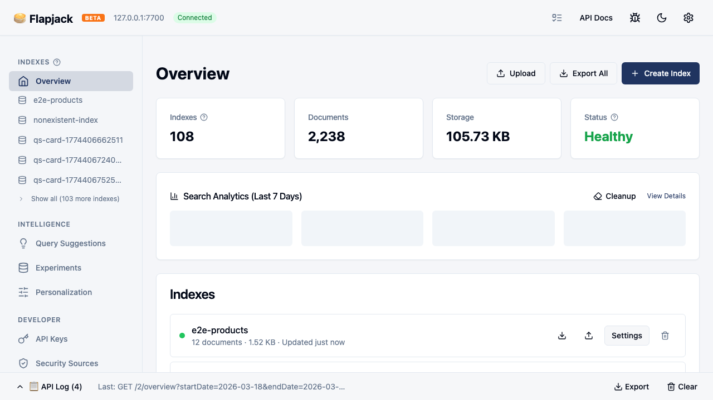
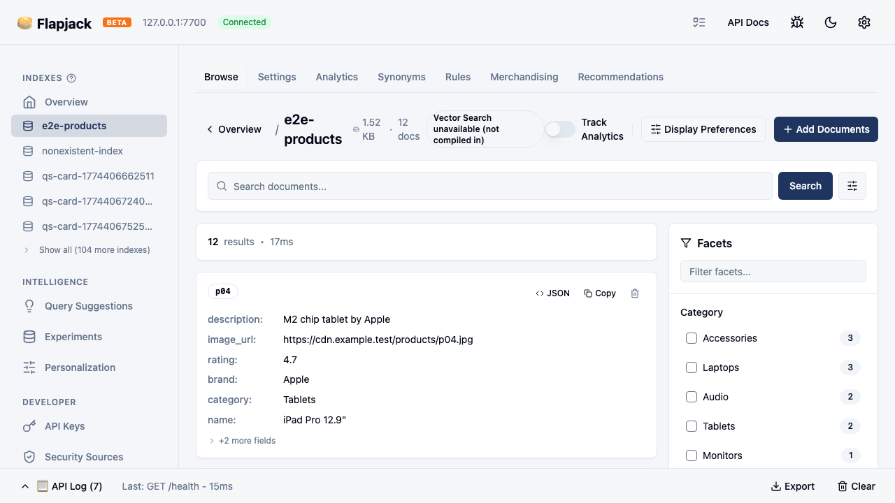
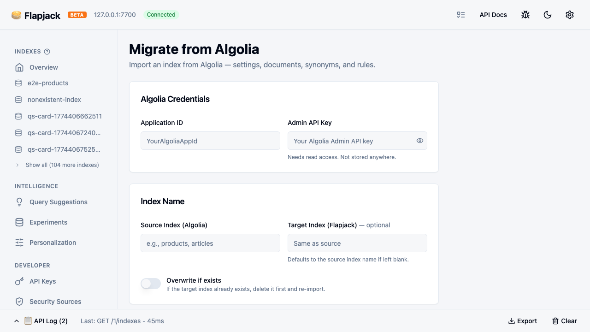

# 🥞 Flapjack

<!-- markdownlint-disable-file MD004 MD013 MD033 MD034 MD040 MD045 MD060 -->

**-> [Project Overview](PROJECT_OVERVIEW.md)** | **[Roadmap](ROADMAP.md)**

[](https://github.com/gridl-staging/flapjack/actions/workflows/ci.yml)
[](https://github.com/gridl-staging/flapjack/releases)
[](LICENSE)

Drop-in replacement for [Algolia](https://algolia.com) — works with [InstantSearch.js](https://github.com/algolia/instantsearch) and the [algoliasearch](https://github.com/algolia/algoliasearch-client-javascript) client. Typo-tolerant full-text search with faceting, geo search, and custom ranking. Single static binary, runs anywhere, data stays on disk.

**[Live Demo](https://flapjack-demo.pages.dev)** · **[Geo Demo](https://flapjack-demo.pages.dev/geo)** · **[API Docs](https://flapjack-demo.pages.dev/api-docs)**

Hosted version: [Flapjack Cloud](https://cloud.flapjack.foo).

---

## Quickstart

```bash
curl -fsSL https://staging.flapjack.foo | sh    # install
flapjack                                        # run the server
```

On first boot Flapjack generates an admin API key and saves it to `data/.admin_key`.
Use that key in the `X-Algolia-API-Key` header for all API requests.

Open the dashboard at **http://localhost:7700/dashboard** or use the API directly:

```bash
# Public status + docs routes
curl -s http://localhost:7700/health | jq '.status'
curl -i http://localhost:7700/health/ready
#   empty or healthy: HTTP 200 {"ready":true}
#   data dir unreadable or tenant search fails: HTTP 503 {"message":"Service unavailable","status":503}
curl -s http://localhost:7700/api-docs/openapi.json | jq '.openapi'
# Browser routes
#   http://localhost:7700/dashboard
#   http://localhost:7700/swagger-ui
```

```bash
API_KEY="$(cat ./data/.admin_key)"   # default data dir; use your custom --data-dir if needed

# Add documents
curl -s -X POST http://localhost:7700/1/indexes/movies/batch \
  -H "X-Algolia-API-Key: $API_KEY" \
  -H "X-Algolia-Application-Id: flapjack" \
  -H "Content-Type: application/json" \
  -d '{"requests":[
    {"action":"addObject","body":{"objectID":"1","title":"The Matrix","year":1999}},
    {"action":"addObject","body":{"objectID":"2","title":"Inception","year":2010}}
  ]}'

# Copy the returned taskID before polling:
TASK_ID=<paste-taskID-from-response>

# Wait for the write task to finish indexing
until [ "$(curl -s http://localhost:7700/1/tasks/$TASK_ID \
  -H "X-Algolia-API-Key: $API_KEY" \
  -H "X-Algolia-Application-Id: flapjack" | jq -r '.status')" = "published" ]; do
  sleep 0.1
done

# Search (typo-tolerant — "matrxi" finds "The Matrix")
curl -X POST http://localhost:7700/1/indexes/movies/query \
  -H "X-Algolia-API-Key: $API_KEY" \
  -H "X-Algolia-Application-Id: flapjack" \
  -H "Content-Type: application/json" \
  -d '{"query":"matrxi"}'
```

These are the same Algolia-compatible `/1/` endpoints your frontend SDK will use — no separate "toy" API.

To rotate the admin key for an existing data directory:

```bash
flapjack --data-dir ./data reset-admin-key
```

<details>
<summary>Note:</summary>

Binaries: [Releases](https://github.com/gridl-staging/flapjack/releases/latest).

```bash
# Install the latest release
curl -fsSL https://staging.flapjack.foo | sh

# Pin a specific release when needed
curl -fsSL https://staging.flapjack.foo | sh -s -- v1.0.10

# Custom install directory
FLAPJACK_INSTALL=/opt/flapjack curl -fsSL https://staging.flapjack.foo | sh

# Skip PATH modification
NO_MODIFY_PATH=1 curl -fsSL https://staging.flapjack.foo | sh
```

</details>

---

## Running Multiple Instances

Use `--instance <name>` to run isolated instances with separate data directories and ports. See [`engine/README.md`](engine/README.md#multi-instance-development) for full multi-instance setup instructions.

---

## Available SDKs

Flapjack ships client SDKs across multiple languages; the list below reflects which are currently installable from public package registries.

- **JavaScript** — `flapjack-search` on npm (with `@flapjack-search/*` scoped support packages: `client-common`, `client-search`, `logger-console`, `requester-browser-xhr`, `requester-fetch`, `requester-node-http`)
- **Python** — `flapjack-search` on PyPI
- **Go** — `github.com/gridl-staging/flapjack-search-go/v4`
- **Ruby** — `flapjack-search` on RubyGems (install-path caveat: the published gem's required-Ruby metadata still reflects the pre-correction floor; build from source if `gem install` rejects your Ruby version)

PHP, Java, C#, Dart, Scala, Kotlin, Swift, and the WordPress plugin are source-available under `sdks/` but not yet published to their public registries.

See `docs/reference/research/jun04_sdk_truth_matrix.md` for the per-package publication evidence.

---

## Migrate from Algolia

### 3-command quickstart

```bash
curl -fsSL https://staging.flapjack.foo | sh
flapjack

curl -X POST http://localhost:7700/1/migrate-from-algolia \
  -H "X-Algolia-API-Key: $API_KEY" \
  -H "X-Algolia-Application-Id: flapjack" \
  -H "Content-Type: application/json" \
  -d '{"appId":"YOUR_ALGOLIA_APP_ID","apiKey":"YOUR_ALGOLIA_ADMIN_KEY","sourceIndex":"products"}'
```

Then initialize your frontend with `flapjackSearch(...)`:

```javascript
import { flapjackSearch } from 'flapjack-search';

// app-id can be any string, api-key is your admin key or a search key
const client = flapjackSearch('flapjack', 'your-flapjack-api-key', {
  hosts: [{ url: 'localhost:7700', protocol: 'http', accept: 'readWrite' }],
});

// Everything else stays the same
```

### Migration API and search check

After the import finishes, search the migrated index:

```bash
curl -X POST http://localhost:7700/1/indexes/products/query \
  -H "X-Algolia-API-Key: $API_KEY" \
  -H "X-Algolia-Application-Id: flapjack" \
  -H "Content-Type: application/json" \
  -d '{"query":"widget"}'
```

For the full JavaScript migration checklist and method matrix, see
[`sdks/javascript/MIGRATION.md`](sdks/javascript/MIGRATION.md).

InstantSearch.js widgets work as-is — `SearchBox`, `Hits`, `RefinementList`, `Pagination`, `GeoSearch`, etc.

---

## Features

| Feature | Details |
|---------|---------|
| Full-text search | Prefix matching, typo tolerance (Levenshtein ≤1/≤2) |
| Filters | Numeric, string, boolean, date — `AND`/`OR`/`NOT` |
| Faceting | Hierarchical, searchable, `filterOnly`, wildcard `*` |
| Geo search | `aroundLatLng`, `insideBoundingBox`, `insidePolygon`, auto-radius |
| Highlighting | Typo-aware, supports nested objects and arrays |
| Custom ranking | Multi-field, `asc`/`desc` |
| Synonyms | One-way, multi-way, alternative corrections |
| Query rules | Conditions + consequences: pin, hide, boost, redirect, userData |
| Pagination | `page`/`hitsPerPage` and `offset`/`length` |
| Distinct | Deduplication by attribute |
| Stop words & plurals | Per-language, 30 languages |
| Batch operations | Add, update, delete, clear, browse |
| API keys | ACL, index patterns, TTL, secured keys (HMAC) |
| S3 backup/restore | Scheduled snapshots, auto-restore on startup |
| Vector / semantic search | OpenAI, REST, FastEmbed, user-provided embedders, HNSW (macOS binaries, Docker, and source builds; pre-built Linux musl/Windows binaries require source build or Docker for vector support) |
| Hybrid search | Keyword + vector with Reciprocal Rank Fusion (RRF; same platform caveat as vector search) |
| A/B testing | Mode A (query overrides), Mode B (index rerouting), interleaving, statistics |
| Personalization | Event scoring, user profile building, query-time `personalizationImpact` |
| Recommendations | Related products, bought-together, trending, looking-similar |
| AI search / RAG | Chat-style query with LLM reranking (BYO provider) |
| Analytics | Search events, click tracking, query suggestions, HA fan-out |
| Federated search | Weighted multi-index queries with RRF merge |

Algolia-compatible REST API under `/1/` — works with InstantSearch.js v5, the algoliasearch client, and [Laravel Scout](integrations/laravel-scout/).

---

## Known limitations

- Multi-node writes serialize through a single-writer lock, so write throughput does not scale linearly across nodes.
- Idempotency replay is restart-durable, but the cache is still node-local; cross-node failover dedup remains deferred to v1.1.
- German compound words like `Schulbus` do not fully decompound because the algorithm does not yet handle combining-form vowel changes (e.g. `Schule` → `Schul-`).

---

## FAQ

**Q: How close is the Algolia API compatibility?**

Flapjack implements all 197 Algolia REST API endpoints under `/1/`. It works with the `algoliasearch` JavaScript client and InstantSearch.js v5 without code changes beyond pointing the host at your Flapjack instance. See the Features table below and the Comparison table for a side-by-side breakdown.

**Q: Does Flapjack support multi-tenancy?**

API keys support ACL restrictions, index-pattern scoping, and TTL expiry, so you can isolate each customer's indexes and control access granularly. Per-index usage counters track search, write, read, and bytes-ingested operations automatically. See the "API keys" row in the Features table.

**Q: What is the write throughput?**

Batch writes use durable-ack semantics — HTTP 200 returns only after the Tantivy commit completes, so no acknowledged document is lost to a crash. The write-queue batch size is tunable via `FLAPJACK_WRITE_QUEUE_BATCH_SIZE` (default 32). Multi-node writes serialize through a single-writer lock, so write throughput does not scale linearly across nodes; see Known limitations above.

**Q: Which InstantSearch.js widgets work?**

All standard InstantSearch.js v5 widgets connect directly to Flapjack's `/1/` endpoints without an adapter: `SearchBox`, `Hits`, `RefinementList`, `Pagination`, `GeoSearch`, and others. The Comparison table lists Flapjack as "Native" for InstantSearch.js support. Laravel Scout is also supported via the [integration package](integrations/laravel-scout/).

**Q: What is the licensing and support model?**

Flapjack is MIT-licensed and free to self-host with no feature gates. For managed hosting, [Flapjack Cloud](https://cloud.flapjack.foo) handles provisioning, backups, and updates. Community support is available through the [GitHub repository](https://github.com/gridl-staging/flapjack).

**Q: How do HMAC-scoped API keys work?**

Flapjack supports the same HMAC-signed secured API keys that Algolia uses for frontend search-only keys. You can scope keys by index pattern, ACL permissions, and TTL expiry through the `/1/keys` endpoints. See the "API keys" and "Scoped API keys (HMAC)" rows in the Features and Comparison tables.

**Q: How do I migrate from Algolia?**

`POST /1/migrate-from-algolia` copies an Algolia index into Flapjack in one request — pass your Algolia app ID, admin key, and source index name. Flapjack pulls the records and settings, creating a local index you can search immediately. Then point your frontend at Flapjack's host; your existing `algoliasearch` client code works without changes. See the [Migrate from Algolia](#migrate-from-algolia) section above for the full walkthrough.

---

## Comparison

|  | Flapjack | Algolia | Meilisearch | Typesense | Elasticsearch | OpenSearch |
|--|----------|---------|-------------|-----------|---------------|-----------|
| Self-hosted | ✅ | ❌ | ✅ | ✅ | ✅ | ✅ |
| License | MIT | Proprietary | MIT + BUSL-1.1 | GPL-3 | ELv2 / SSPL / AGPL | Apache 2.0 |
| Algolia-compatible API | ✅ | — | ❌ | ❌ | ❌ | ❌ |
| InstantSearch.js | Native | Native | Adapter | Adapter | Community | Community |
| Built-in Algolia migration | ✅ | — | ❌ | ❌ | ❌ | ❌ |
| Typo tolerance | ✅ | ✅ | ✅ | ✅ | ✅ | ✅ |
| Faceting (hierarchical) | ✅ | ✅ | ✅ | ✅ | ✅ | ✅ |
| Filters (numeric, string, bool, date) | ✅ | ✅ | ✅ | ✅ | ✅ | ✅ |
| Geo search | ✅ | ✅ | ✅ | ✅ | ✅ | ✅ |
| Synonyms | ✅ | ✅ | ✅ | ✅ | ✅ | ✅ |
| Query rules (pin/hide/boost/redirect) | ✅ | ✅ | ❌ | ✅ | ✅ | ✅ |
| Custom ranking | ✅ | ✅ | ✅ | ✅ | ✅ | ✅ |
| Analytics | ✅ | ✅ | Cloud only | ✅ | ✅ | ✅ |
| Scoped API keys (HMAC) | ✅ | ✅ | ✅ | ✅ | ✅ | ❌ |
| S3 backup/restore | ✅ | N/A | ❌ | ❌ | Snapshots | Snapshots |
| Dashboard UI | ✅ | ✅ | ✅ | Cloud only | Kibana | Dashboards |
| Embeddable as library | ✅ | ❌ | ❌ | ❌ | ❌ | ❌ |
| HA / clustering | 🟡 (bounded convergence)† | ✅ | Cloud only | ✅ | ✅ | ✅ |
| Multi-language | 30 languages + CJK tokenization | 60+ | Many | Many | Many | Many |
| Vector / semantic search | ✅* | ✅ | ✅ | ✅ | ✅ | ✅ |
| AI search (RAG) | ✅ | ✅ | ✅ | ✅ | ✅ | ✅ |
| Hybrid search (keyword + vector) | ✅* | ✅ | ✅ | ✅ | ✅ | ✅ |
| Personalization | ✅ | ✅ | ❌ | ❌ | ❌ | ❌ |
| Recommendations | ✅ | ✅ | ❌ | ❌ | ❌ | ❌ |
| Federated multi-index search | ✅ | ✅ | ✅ | ✅ | ✅ | ✅ |
| A/B testing | ✅ | ✅ | ❌ | ❌ | ❌ | Partial |

* Flapjack vector and hybrid search are available in macOS pre-built binaries, Docker images, and source builds. Pre-built Linux musl (`x86_64`/`aarch64`) and Windows (`x86_64`) binaries ship without vector support. Check runtime capability with `GET /health` → `capabilities.vectorSearch`.

† HA / clustering replication converges to a bounded steady-state spread (a small residual count difference) rather than exact per-node equality under sustained rolling restarts; the residual reflects nginx restart-window write loss and is tracked as roadmap **PL-8**. Canonical evidence and interpretation: [`engine/loadtest/BENCHMARKS.md`](engine/loadtest/BENCHMARKS.md) (HA Soak Proof).

---

## Deployment

```bash
cd engine
cargo build -p flapjack-server --release
./target/release/flapjack
```

Requires stable Rust. The Rust workspace lives under `engine/`. Pre-built binaries for Linux x86_64 (static musl), Linux ARM64, macOS Intel, macOS Apple Silicon, and Windows x86_64 are available on the [releases page](https://github.com/gridl-staging/flapjack/releases/latest). Vector search is included in macOS pre-built binaries, Docker images, and source builds; pre-built Linux musl and Windows binaries ship without vector support (build from source or use Docker when vector search is required).

### Single Node

Listens on `127.0.0.1:7700` by default. Override with `--bind-addr` or `FLAPJACK_BIND_ADDR`.

### Docker

```bash
docker build -t flapjack -f engine/Dockerfile .
docker run -d --name flapjack \
  -p 7700:7700 \
  -v /tmp/fj-data:/data \
  flapjack
```

The Dockerfile sets `FLAPJACK_BIND_ADDR=0.0.0.0:7700` so the container is host-reachable by default.

#### Docker Compose Quickstart

A single-node Docker Compose setup (builds from source, auth disabled) is available at [`engine/examples/quickstart/`](engine/examples/quickstart/). Use it only on a trusted local machine: it publishes port `7700` and is intended for loopback-only development, not shared networks or internet-reachable hosts. For any non-local deployment, keep auth enabled and follow the standard quickstart or deployment docs instead. Run `docker compose up -d --build` and hit `http://localhost:7700/health`.

### Multi-Node Examples

- HA topology (nginx-routed): [`engine/examples/ha-cluster/`](engine/examples/ha-cluster/)
- 2-node replication + analytics fan-out: [`engine/examples/replication/`](engine/examples/replication/)
- S3 snapshot backup/restore with MinIO: [`engine/examples/s3-snapshot/`](engine/examples/s3-snapshot/)

---

## Configuration

| Variable | Default | Description |
|----------|---------|-------------|
| `FLAPJACK_DATA_DIR` | `./data` | Index storage directory |
| `FLAPJACK_BIND_ADDR` | `127.0.0.1:7700` | Listen address |
| `FLAPJACK_ADMIN_KEY` | — | Admin API key (enables auth) |
| `FLAPJACK_ENV` | `development` | `production` requires auth on all endpoints |
| `FLAPJACK_S3_BUCKET` | — | S3 bucket for snapshots |
| `FLAPJACK_S3_REGION` | `us-east-1` | S3 region |
| `FLAPJACK_SNAPSHOT_INTERVAL` | `0` (disabled) | Auto-snapshot interval in integer seconds |
| `FLAPJACK_SNAPSHOT_RETENTION` | `24` | Retention count (snapshots per index) |

Data stored in `FLAPJACK_DATA_DIR`. Mount as a volume in Docker.
Full operator defaults and env-var types are canonical in [`engine/docs2/3_IMPLEMENTATION/OPS_CONFIGURATION.md`](engine/docs2/3_IMPLEMENTATION/OPS_CONFIGURATION.md).

---

## Analytics Cluster Mode (Multi-node)

When peers are configured, `/2/*` analytics routes merge local + peer analytics results at query time and return cluster metadata.
This is fan-out/merge behavior, not leader election or automatic node promotion.

**Behavior summary:**

- Each node keeps its own local analytics writes.
- Query fan-out/merge is handled in `maybe_fan_out` for `/2/*` endpoints.
- `X-Flapjack-Local-Only: true` disables fan-out and returns local-only analytics.

**Response shape** — every analytics response in cluster mode includes a `cluster` field:

```json
{
  "count": 18456,
  "cluster": {
    "nodes_total": 3,
    "nodes_responding": 3,
    "partial": false,
    "node_details": [
      {"node_id": "node-a", "status": "Ok", "latency_ms": 1},
      {"node_id": "node-b", "status": "Ok", "latency_ms": 12},
      {"node_id": "node-c", "status": "Ok", "latency_ms": 14}
    ]
  }
}
```

`partial: true` means one or more nodes were unreachable; the response contains data from the responding nodes only.

**Users count** uses HyperLogLog (p=14, ~0.8% error) so shared users across nodes are not double-counted. All other metrics (search counts, rates, click positions, etc.) are exact sums.

Verified examples:

- [`engine/examples/replication/`](engine/examples/replication/) (`test_replication.sh`) proves 2-node fan-out with merged count and `cluster` metadata checks.
- [`engine/examples/ha-cluster/`](engine/examples/ha-cluster/) (`test_ha.sh`) proves 3-node nginx-routed fan-out in that compose topology.

---

## API Documentation

- [Online API docs](https://flapjack-demo.pages.dev/api-docs)
- [Swagger UI](http://localhost:7700/swagger-ui) (local)

---

## Use as a Library

Flapjack's core can be embedded directly:

```toml
[dependencies]
flapjack = { version = "1.0", default-features = false }
```

See [LIB.md](engine/LIB.md) for the embedding guide.

---

## Architecture

Built on [Tantivy](https://github.com/quickwit-oss/tantivy) with a pinned fork for edge-ngram prefix search. The Rust workspace lives under `engine/`.

```
engine/src/                   # Core library (search, indexing, query execution)
engine/flapjack-http/         # HTTP server (Axum handlers, routing)
engine/flapjack-replication/  # Cluster coordination
engine/flapjack-ssl/          # TLS (Let's Encrypt, ACME)
engine/flapjack-server/       # Binary entrypoint
engine/dashboard/             # Built-in dashboard UI
```

---

## Development

```bash
cd engine
cargo install cargo-nextest
./s/test
```

See [`engine/README.md`](engine/README.md) for the full workspace map, focused test commands, and multi-instance local-development flow.

---

## Dashboard Screenshots

Flapjack includes a built-in dashboard UI served at `http://localhost:7700/dashboard` when the server is running.







---

## License

 [MIT](LICENSE)
